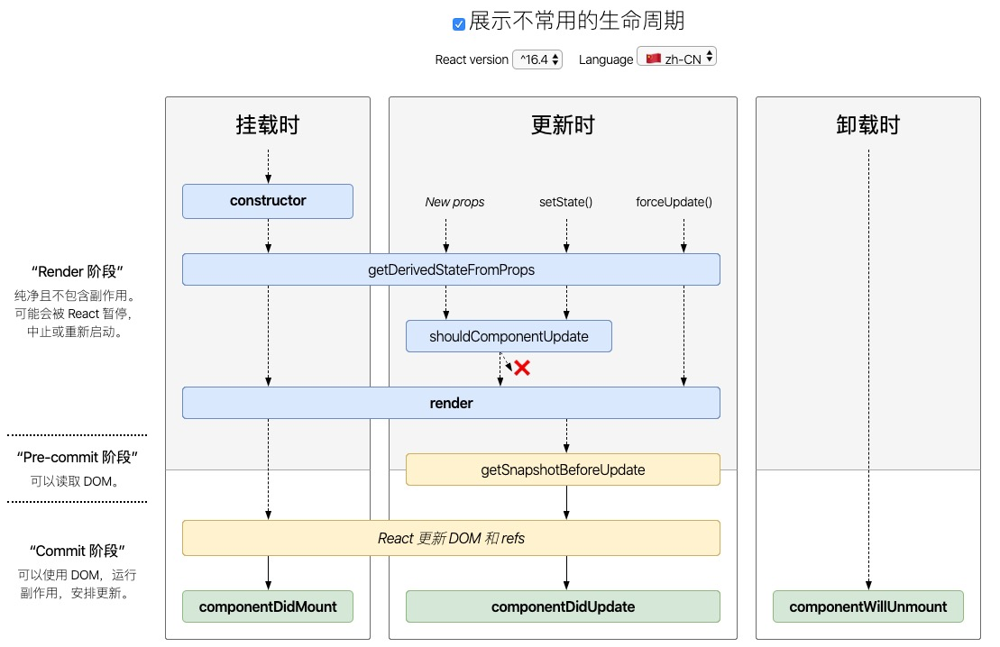

[TOC]
# React note

> React项目笔记，个人记录一些使用方法

## 生命周期 v16.8以前版本


[文档地址](http://projects.wojtekmaj.pl/react-lifecycle-methods-diagram/)

包括：
- constructor - 挂载时
- componentDidMount - 挂载阶段
- shouldComponentUpdate
- componentDidUpdate - 更新阶段
- componentWillUnmount - 卸载阶段
- render

> 分成三部分去记忆比较方便

1. 挂载时

```flow
st=>start: constructor
op1=>operation: getDerivedStateFromProps
op2=>operation: render
op3=>operation: React更新DOM和refs
e=>end: componentDidMount

st->op1->op2->op3->e
```

2. 更新时

```flow
st=>start: getDerivedStateFromProps
op1=>operation: shouldComponentUpdate
op2=>operation: render
op3=>operation: getSnapshotBeforeUpdate
op4=>operation: React更新DOM和refs
e=>end: componentDidUpdate

st->op1->op2->op3->e
```

3. 卸载时

componentWillUnmounts

## 组件通信

## 组件按需加载

## css模块化

目前`create-react-app`版本暂不支持`module.less`

会提示`localIdentName`非法的错误
```
ValidationError: Invalid options object. CSS Loader has been initialized using an options object that does not match the API schema.
 - options has an unknown property 'localIdentName'. These properties are valid:
   object { url?, import?, modules?, sourceMap?, importLoaders?, localsConvention?, onlyLocals?, esModule? }
```

参考
> css-loader
https://github.com/webpack-contrib/css-loader#modules
https://github.com/rails/webpacker/issues/2197


## HOOK使用

## redux 和 react-redux

## diff算法
